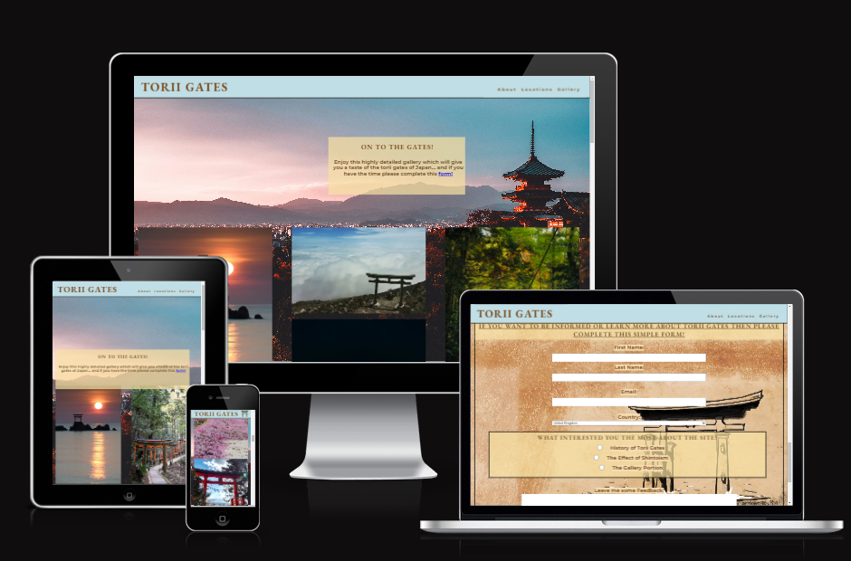
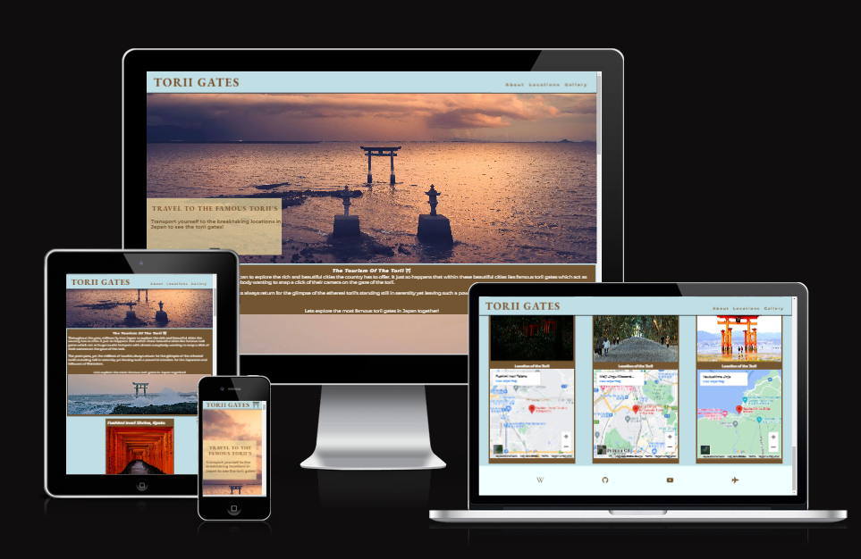
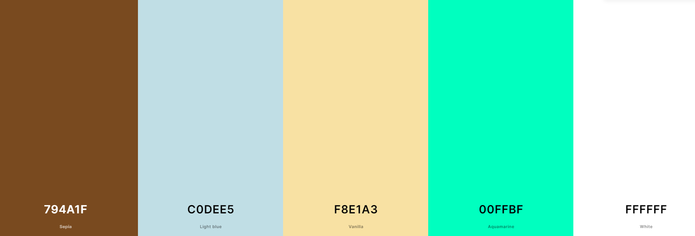

# Torii Gates

-This project is designed to transport you to Japan to learn and wonder at the torii gates that rule over Japan giving spirituality,
 emotion and a sense of mystical resonance. The project 'Torii Gates' contains three pages with two being highly informative. Although the two pages are highly informative they set the tone and offer users a chance to wonder and gaze at images of the torii gates that this project is concerned with.

 As stated this project has three pages consisting of :
 - index.html / **primarily an informative page concerned with educating users to the history, facts and mystery of the gates**
 - locations.html / **dedicated to showcasing the select most famous torii's in Japan with a heavier emphasis on showing the user with the use of images**
 - gallery.html / **As you may have guessed, a gallery page to fully transport the user to Japan with a look on highly detailed images of torii's**

 ## Table of Contents
- [Mockup Screenshots](#mockup-screenshots)
- [Wireframes](#wireframes)
- [Features](#features)
- [Usage](#usage)
- [User Stories](#user-stories)
- [UX](#ux)
- [Testing](#testing)
- [Contributing](#contributing)
- [License](#license)
- [Contact](#contact)

## Mockup Screenshots
These are the mockup screenshots of the three pages index.html, locations.html and gallery.html created using the "Am I Responsive" website.
    | 

## Wireframes
[Include wireframes of your project here]
Please see the pictures below for the wireframes of this project. The pages index.html and location.html follow the exact same structure so they will be represented with the same wireframe for mobile, tablet and desktop

### Mobile Wireframes

### Tablet Wireframes

### Desktop Wireframes

## Features
- [List of key features or functionalities]
- [Another feature]

## Usage
[Instructions on how to use the project or any relevant usage examples]

## User Stories
1. As a visitor, I want to be able to easily navigate through different sections of the website using the navigation bar.
2. As a user, I want to view detailed information about the locations featured in the Torii Gates.
3. As a visitor, I want to explore a gallery showcasing images related to the Torii Gates.
4. As a user, I want to learn about the history and significance of Torii Gates through informative articles and videos.

## UX
[Include information about the user experience aspects of your project]
- The design for my project intially came from wireframing and creating the overall structure that the page would be using. 
- Through wireframing, I concluded what the structure would be on all of the pages and set out to build my website in that image.
- A simple yet stylistic look with the use of color and images was at the forefront of the development process for "Torii Gates".
- The navigation of the page was minimal and direct to showcase that there were three distinct pages.

### Color Scheme 
- The colors that were used in this project were carefully picked to ensure that this page can be as transportitive as possible.
- The project uses colors widely associated with torii gates in Japan to achieve this transportitive effect. 
- The colors that were used are:-

-  `#794a1f` this color was mainly used to create the box containers that holds the text and images within it. This color however, was used in other places in the project such as in the hero sections and nav elements and later in the gallery's form.

- `#c0dee5` this color was used as background-color for elements such as the header and the div that contains the main boxes where information is displayed. This color
was complemented with the color above '794a1f' many times during this project. 

- These colors were planned to be used before the projects inception. The sky blue that `c0dee5` gives is akin to a light sky or a light body of water whilst `794a1f`
gives off a dark brown similar to wood. These were planned beforehand as torii gates are often made out of wood and images online show torii gates whilst the blue sky is in sight.

- `rgba(248, 225, 163, 0.7)` was another color that was used but mainly as a background to hero images. The opacity was put at 0.7 to make sure that the image was still visible behind this background color. 

- `white` was used for the text on this project as it complements the dark brown color `794a1f` gives off within the container. It was also another preplanned color as many torii gates in Japan are white so in order to make this project feel transportitive, these colors were used in unison to give off that effect.

`aquamarine` was used to color the emphasis elements in the project. This color was not determined before the project began. It was used to give a good user experience to 
visitors of the site so that important words, phrases stick would stick with them.

I used the website [coolors.co](https://coolors.co/7f0ffb-c27b6f-9ecffa-fafafa-000000) to generate the color pallete.

Click this for a Coolers screenshot

  

### Typography 

- I used two fonts in particular in this project. They were imported by the use of Google Fonts. 

## Testing
[Describe the testing process and methodologies used in your project]

## Deployment 

## Contributing
Contributions are welcome! If you'd like to contribute to Torii Gates, please follow these steps:
1. Fork the repository
2. Create your feature branch (`git checkout -b feature/YourFeature`)
3. Commit your changes (`git commit -m 'Add some feature'`)
4. Push to the branch (`git push origin feature/YourFeature`)
5. Open a pull request

## License
[Include information about the project's license, if applicable]

## Contact
[Provide contact information or instructions on how to reach out for support or inquiries]

###  Acknowledgements
- I would like to thank my Code Institute mentor [Alan Bushell] (https://github.com/Alan-Bushell)
- I would like to thank my stand-in mentor at Code Institute; [Chris Quinn] (https://github.com/10xOXR)
- I would like to thank the Code Institue [slack community] (https://code-institute-room.slack.com)
- I would like to thank my family and friends for helping support me through my first ever project 

