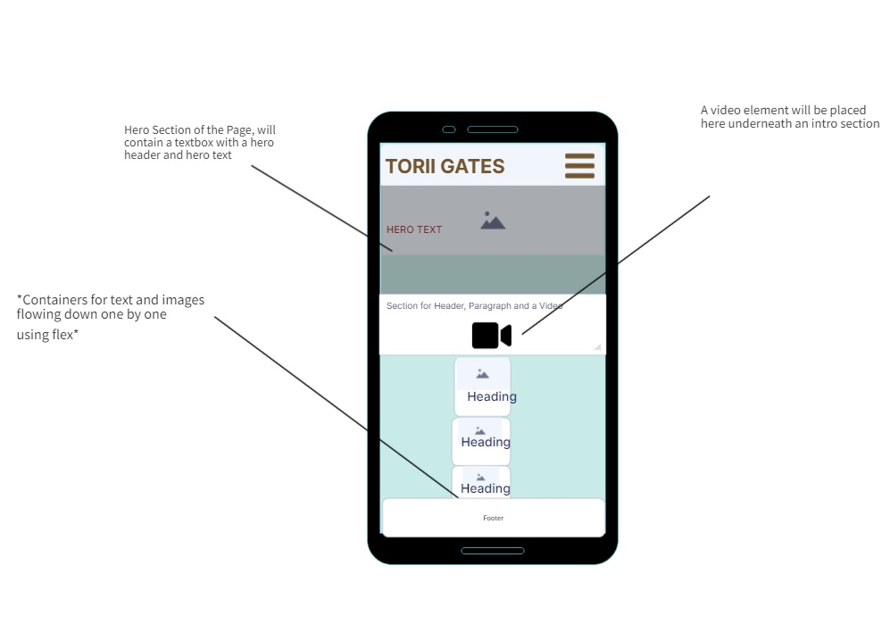
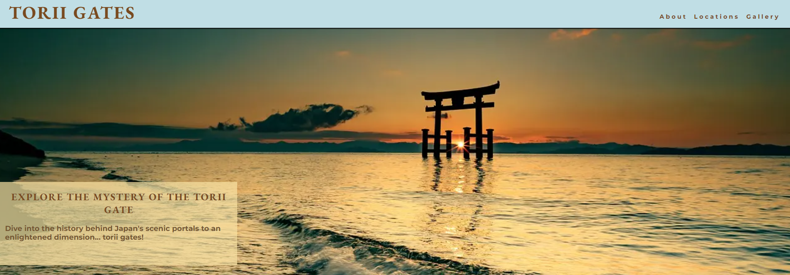

# Torii Gates

This project is designed to transport you to Japan to learn and wonder at the torii gates that rule over Japan giving spirituality,
 emotion and a sense of mystical resonance. The project 'Torii Gates' contains three pages with two being highly informative. Although the two pages are highly informative they set the tone and offer users a chance to wonder and gaze at images of the torii gates that this project is concerned with.

 As stated this project has three pages consisting of :
 - index.html / **primarily an informative page concerned with educating users to the history, facts and mystery of the gates**
 - locations.html / **dedicated to showcasing the select most famous torii's in Japan with a heavier emphasis on showing the user with the use of images**
 - gallery.html / **As you may have guessed, a gallery page to fully transport the user to Japan with a look on highly detailed images of torii's**

 ## Table of Contents
- [Mockup Screenshots](#mockup-screenshots)
- [Wireframes](#wireframes)
- [Features](#features)
- [User Stories](#user-stories)
- [UX](#ux)
- [Tools & Technologies](#tools--technologies)
- [Testing](#testing)
- [Deployment](#deployment)
- [Acknowledgements](#acknowledgements)

## Mockup Screenshots
These are the mockup screenshots of the three pages index.html, locations.html and gallery.html created using the "Am I Responsive" website.
    

## Wireframes
[Include wireframes of your project here]
 Please see the pictures below for the wireframes of this project. These wireframes will showcase the pages layout, and structure in the project's inception period. 
 - These are wireframes in their inception giving a blueprint as to how the website will look and feel. 
 - Since the creation of these wireframes the website has greatly built upon these wireframes.

 - It is important to note that index.html and locations.html pages follow the exact same structure and layout therefore, only one screenshot of the wireframe of one of the pages will suffice.

### Mobile Wireframes
| index.html/locations.html | gallery.html | 
| :---: | :---: |
|  |  | 

### Tablet Wireframes
| index.html/locations.html | gallery.html | 
| :---: | :---: |
|  |  | 

### Desktop Wireframes
| index.html/locations.html | gallery.html | 
| :---: | :---: |
|  |  |

## Features

| Feature | Description | Screenshot |
| :---: | :---: | :---: |
| **Navigation Logo** | The navigation bar on mobile devices is behind a torii gate which drops down the menu |  |
| **Navigation Hover** | The navigation on desktop when hovered upon is highlighted in a red color showcasing that it is something interactable |  |
| **Video Controls** | The video element has controls where you can unmute, fullscreen or stop the video |  |
| **Footer Links** | The footer element has clickable links that are logos from FontAwesome |  |
| **iframe** | An iframe element was used as a feature in this project which is scrollable with your fingers on tablet, mobile and with mouse on desktop |  |
| **Hover Submit Button** | The form in gallery.html has input elements all with a hover element to change the background color |  |
| **Hero Image** | A hero image to instantly draw the user's attention with a torii gate|  |
| **Gallery Page** | There is a gallery page included in the site to dive into the world of torii gates |  |
| **Famous Torii Locations** | There is a page dedicated to showcasing the most famous torii's in Japan |  |

### Future Features

- In the future when I possibly come back to this project to improve upon it, I would like to add more features.
- I would like to add transitions through images and transitions and delays on background colors/images through the use of JavaScript.
- I would like to add more features concerning psuedoclasses to change how elements behave.

## User Stories
1. As a new user, I want to be able to easily navigate through the pages of the website.
2. As a new user, I want to see the most famous torii gates in Japan.
3. As a new user, I want to explore a gallery showcasing images related to the torii Gates.
4. As a new user, I want to learn about the history and meaning behind the torii gates.
5. As a new user, I want to learn about the history and significance of Torii Gates through informative articles and videos.
6. As a new user, I want to know where I can learn more about torii gates after exahusting the website.

## UX
[Include information about the user experience aspects of your project]
- The design for my project intially came from wireframing and creating the overall structure that the page would be using. 
- Through wireframing, I concluded what the structure would be on all of the pages and set out to build my website in that image.
- A simple yet stylistic look with the use of color and images was at the forefront of the development process for "Torii Gates".
- The navigation of the page was minimal and direct to showcase that there were three distinct pages.

### Color Scheme 
- The colors that were used in this project were carefully picked to ensure that this page can be as transportitive as possible.
- The project uses colors widely associated with torii gates in Japan to achieve this transportitive effect. 
- The colors that were used are:-

-  `#794a1f` this color was mainly used to create the box containers that holds the text and images within it. This color however, was used in other places in the project such as in the hero sections and nav elements and later in the gallery's form.

- `#c0dee5` this color was used as background-color for elements such as the header and the div that contains the main boxes where information is displayed. This color
was complemented with the color above '794a1f' many times during this project. 

- These colors were planned to be used before the projects inception. The sky blue that `c0dee5` gives is akin to a light sky or a light body of water whilst `794a1f`
gives off a dark brown similar to wood. These were planned beforehand as torii gates are often made out of wood and images online show torii gates whilst the blue sky is in sight.

- `rgba(248, 225, 163, 0.7)` was another color that was used but mainly as a background to hero images. The opacity was put at 0.7 to make sure that the image was still visible behind this background color. 

- `white` was used for the text on this project as it complements the dark brown color `794a1f` gives off within the container. It was also another preplanned color as many torii gates in Japan are white so in order to make this project feel transportitive, these colors were used in unison to give off that effect.

`aquamarine` was used to color the emphasis elements in the project. This color was not determined before the project began. It was used to give a good user experience to 
visitors of the site so that important words, phrases stick would stick with them.

I used the website [coolors.co](https://coolors.co/7f0ffb-c27b6f-9ecffa-fafafa-000000) to generate the color pallete.

Click this for a Coolers screenshot

  

### Typography 

- I used two fonts in particular in this project. They were imported by the use of Google Fonts. 
- Some header elements were a font called [EB Garamond](https://fonts.google.com/specimen/EB+Garamond).
- However, most of the text within this project including most of the headers are in [Montserrat](https://fonts.google.com/specimen/Montserrat).

- When I was designing this website, I wanted to make sure that the text looks very clean and professional. Montserrat was the font that I was looking for because of it's
modern design and easy on the eye visibility. 

## Tools & Technologies 

- [HTML](https://en.wikipedia.org/wiki/HTML) used for the content of the site.
- [CSS](https://en.wikipedia.org/wiki/CSS) used to style the html that it within the site.
- [CSS Flexbox](https://www.w3schools.com/css/css3_flexbox.asp) used to give the website a responsive design.
- [Git](https://git-scm.com/) used to control the site via "git add, git commit -m, git push" and etc.
- [GitHub](https://github.com/) was used to store my code and acess my project repository. 
- [GitHub Pages](https://pages.github.com/) was used to deploy my site and make it live.
- [Favicon.cc](https://www.favicon.cc/) was used to create the site favicon.
- [VScode](https://code.visualstudio.com/) used as an IDE through GitPod.
- [Gitpod](https://www.gitpod.io/) used as the IDE to work and code the site.
- [Font Awesome](https://fontawesome.com/) used to obtain logos such as the torii gate logo in the mobile navigation.
- [Google Fonts](https://fonts.google.com/) used to import fonts into the site.
- [ezgif](https://ezgif.com/optiwebp) used to compress images and videos to small file sizes.
- [maps.ie](https://www.maps.ie/create-google-map/) used to create iframe for google maps locations.

## Testing
 
 Please refer to the [TESTING.md](TESTING.md) file to see the testing of the website.

## Deployment 

This site was deployed via. GitHub Pages.

- To deploy the site and make it live follow these steps.
- Once you are at the [GitHub repository](https://github.com/mahidaCodeTrained/project1-toriigate) go through the navigation tab until you come across Settings.
- In the Settings there should be a segment that says GitHub Pages that you must click to deploy.
- Once you have clicked GitHub Pages, you need to select the "main branch" under build and deployment. 
- When you have selected the main branch then you should save upon doing so the page will refresh indicating a successful deployment.

 The live page to this project can be found [here](https://mahidacodetrained.github.io/project1-toriigate/)

### Local Deployment 

- This project can be saved and stored into your local device via forking or cloning.

### Cloning 

This repository can be cloned by following these steps.

1. Go to the [GitHub repository](https://github.com/mahidaCodeTrained/project1-toriigate) for this project.
2. There should be a code button telling you if you would like to clone this project.
3. It should tell you if you would like to clone via. HTTPS, SSH or a GitHub CLI, once you have decided click the copy button to copy the url of the project.
4. Open Git Bash or a Terminal
5. Once inside, change the working directory to the one where you want the cloned directory that you have copied from the GitHub repository.
6. In the IDE terminal, you can now clone my repository by inputting this command:
   - `git clone https://github.com/mahidaCodeTrained/project1-toriigate`

##  Acknowledgements
- I would like to thank my Code Institute mentor [Alan Bushell] (https://github.com/Alan-Bushell)
- I would like to thank my stand-in mentor at Code Institute; [Chris Quinn] (https://github.com/10xOXR)
- I would like to thank the Code Institue [slack community] (https://code-institute-room.slack.com)
- I would like to thank my family and friends for helping support me through my first ever project 

