# Testing

Return to the [README.md](README.md) file.

## Table of Contents

Click here for Table of Contents

- [Validation](#validation)
  - [HTML](#html)
  - [CSS](#css)
  
- [Browser Compatibility](#browser-compatibility)

- [Responsiveness](#responsiveness)

- [Lighthouse](#lighthouse)

- [User Story Testing](#user-story-testing)

- [Bugs](#bugs)

## Validation

### HTML

- The W3C Markup Validator checks the markup validity of websites to see if there is any error in the coding of the website. It is a crucial tool to use to know if the site is completely validated with no errors.
- HTML on every page was checked alongside the CSS of the site. 

| Page | W3C URL | Screenshot | Notes |
| :---: | :---: | :---: | :---: |
| index.html | [W3C](https://validator.w3.org/nu/?doc=https%3A%2F%2Fmahidacodetrained.github.io%2Fproject1-toriigate%2Findex.html) | 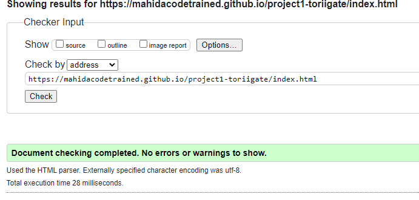 | Passed all checks |
| locations.html | [W3C](https://validator.w3.org/nu/?doc=https%3A%2F%2Fmahidacodetrained.github.io%2Fproject1-toriigate%2Flocations.html) | 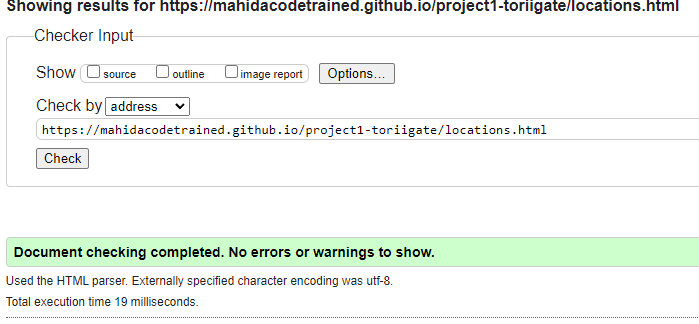 | Passed all tests |
| gallery.html | [W3C](https://validator.w3.org/nu/?doc=https%3A%2F%2Fmahidacodetrained.github.io%2Fproject1-toriigate%2Fgallery.html) | 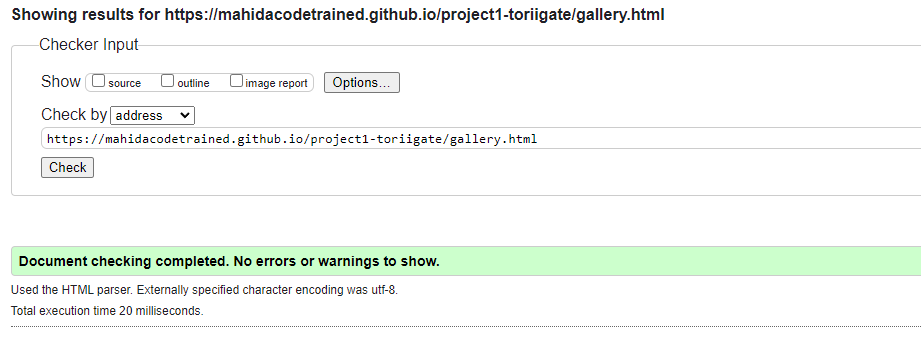 | Passed all tests |

### CSS
| Page | Jigsaw URL | Screenshot | Notes |
| :---: | :---: | :---: | :---: |
| style.css | [Jigsaw](https://jigsaw.w3.org/css-validator/validator?uri=https%3A%2F%2Fmahidacodetrained.github.io%2Fproject1-toriigate%2F&profile=css3svg&usermedium=all&warning=1&vextwarning=&lang=en) | 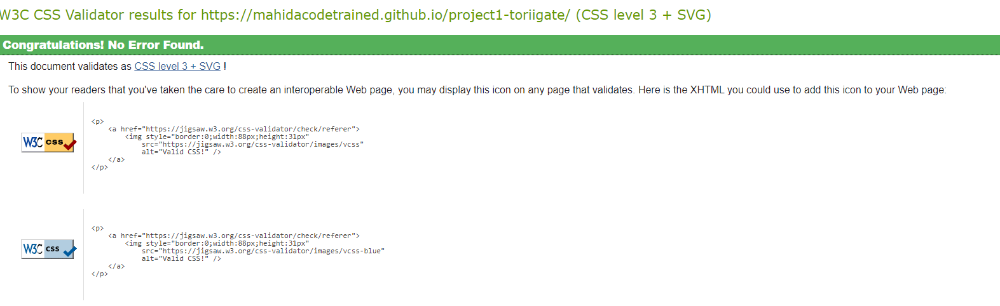 | Passed all checks |

## Browser Compatibility

- To make sure that the site is looking good we have to look at how the site is displayed on different browser engines. 
- We will look at Google Chrome, Firefox and Microsoft Edge.

| Engine | Screenshot | Comments |
| :---: | :---: | :---: |
| Chrome | 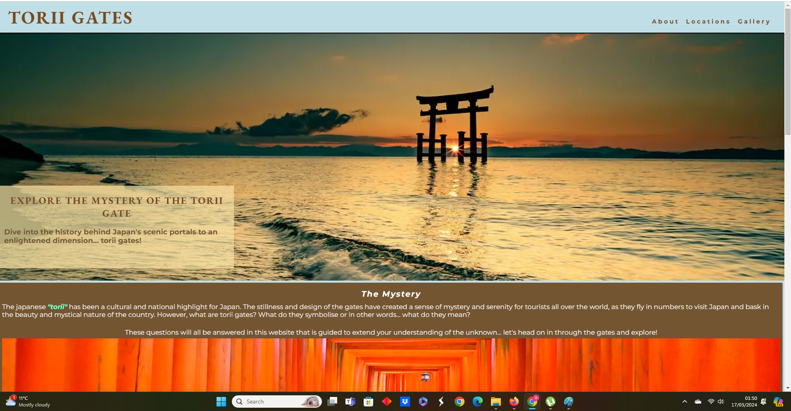 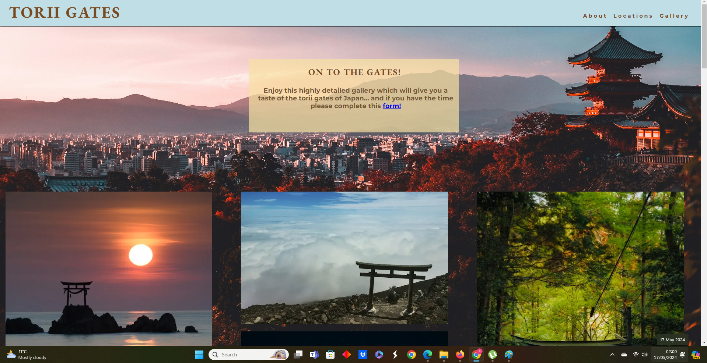 | Looks Good on Chrome |
| Firefox | 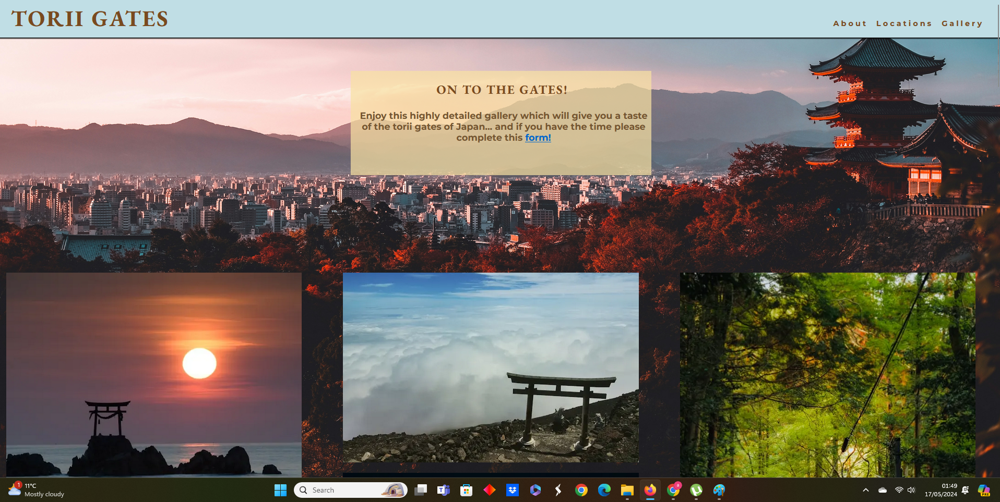 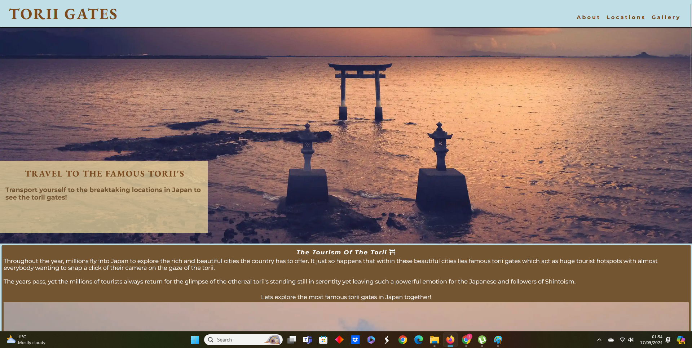 | Looks Good on Firefox |
| Microsoft Edge | 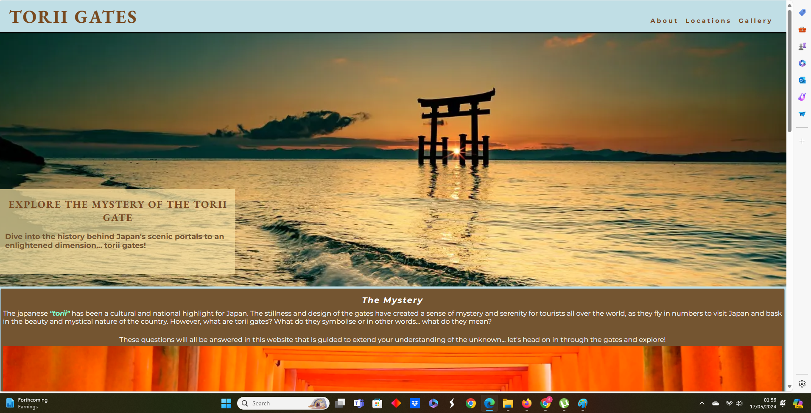 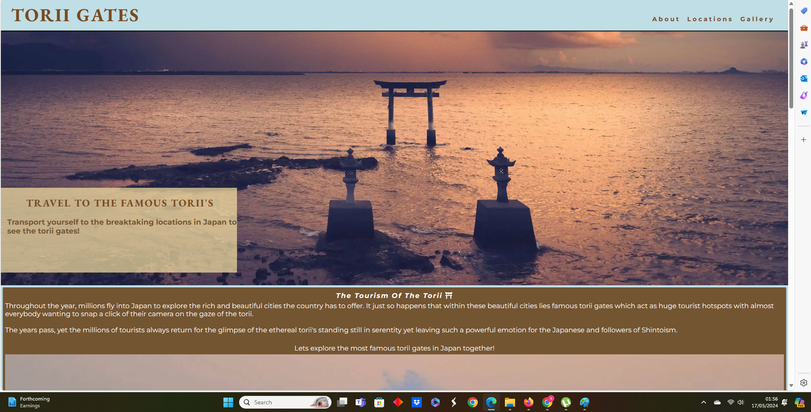 | Looks Good on Edge |

## Responsiveness

- "Torii Gates" looks great everywhere. It is fully responsive on small mobile phones, medium mobile phones, tablets and the browser window.
- Media Queries were set up in the CSS code to ensure full responsiveness of the site.
- Media Queries allowed me to target certain elements and change the shape of them or classes and id's to make them bigger, smaller in their measurments to get a good responsive page.
- CSS Flexbox was also used to achieve this.

- To check the responsiveness of the website you can follow these steps:
1. Go to the [live site](https://mahidacodetrained.github.io/project1-toriigate/) and right cick with your mouse on the screen.
2. Once you have right clicked you will see a menu. Find Inspect Element.
3. Once you have found inspect element you will see responsive design on the top of the page.
4. This is where you can now scroll and drag the site to see how it looks like on different screen sizes.

## Lighthouse

I conducted lighthouse audits on all of the pages on mobile and desktop to see the results.

| Page | Mobile | Desktop | Notes |
| :---: | :---: | :---: | :---: |
| index.html | 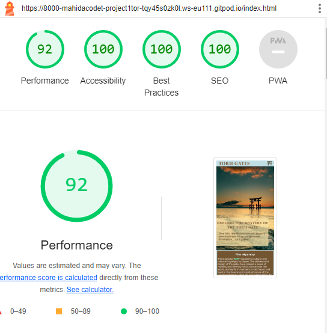 | 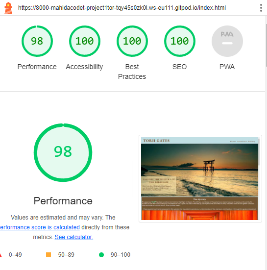 | It is overall a great performance, there are a few little hiccups on mobile but it's still performing. |
| locations.html | 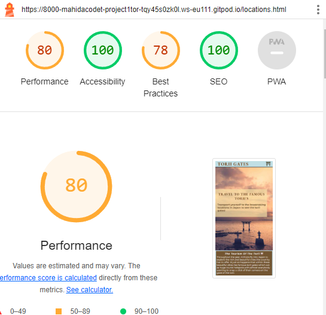 | 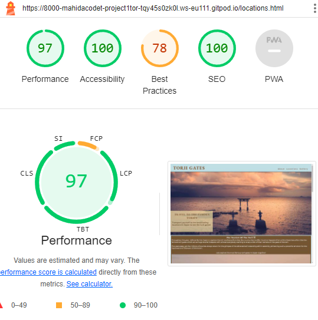 | It is great on desktop almost perfect. Mobile performance although not bad can be improved but there are too many third party cookies. |
| gallery.html | 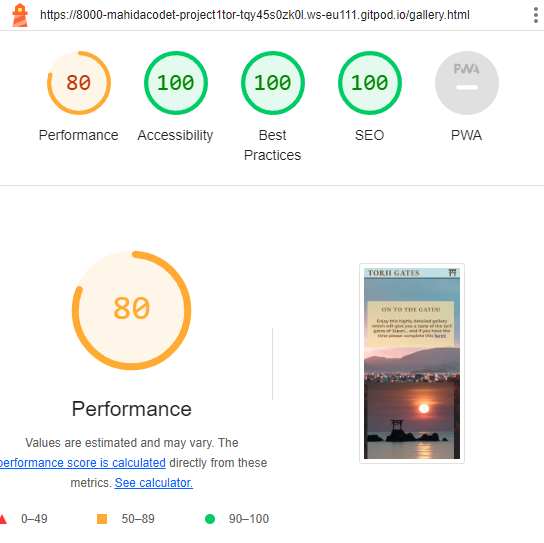 | 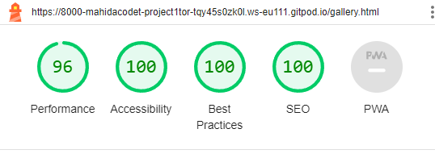 | The load times on desktop are great, mobile suffers due to many images and the parralax. |

- The site is performing great on all accounts in desktop. 
- The best practices are low due to the iframes in locations.html. 
- Mobile performances suffers due to the hero images and many images to render.

## User Story Testing 

| User Story | Screenshot |
| :---: | :---: |
| As a new user, I want to be able to easily navigate through the pages of the website. | 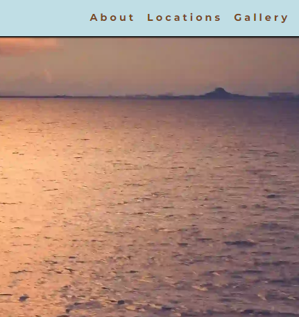 |
| As a new user, I want to see the most famous torii gates in Japan. | 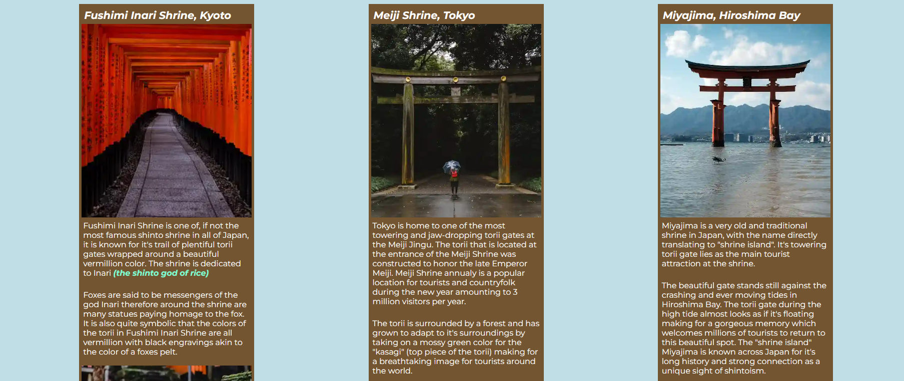 |
| As a new user, I want to explore a gallery showcasing images related to the torii Gates. | 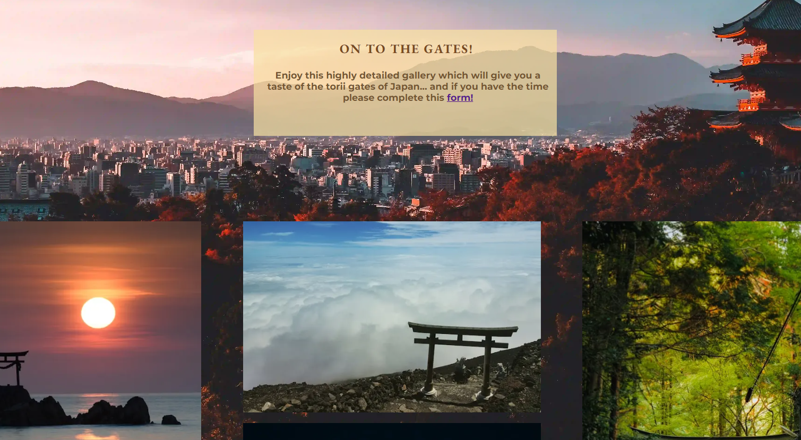 |
| As a new user, I want to learn about the history and meaning behind the torii gates. | 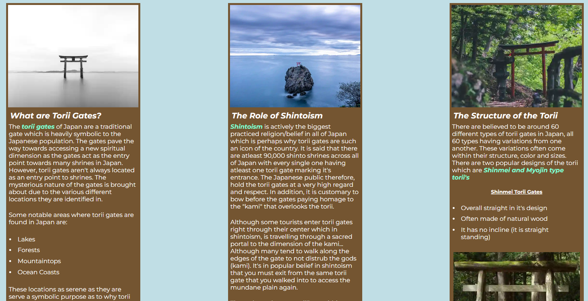 |
| As a new user, I want to learn about the history and significance of Torii Gates through informative articles and videos. | 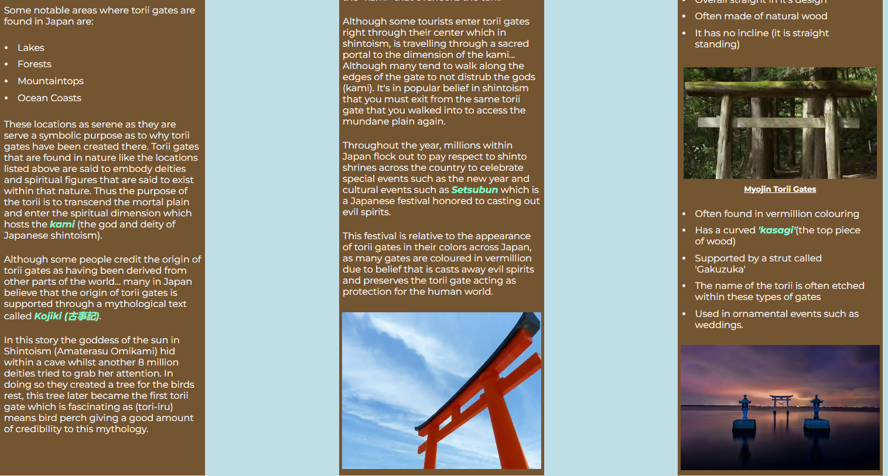 .png) |
| As a new user, I want to know where I can learn more about torii gates after exahusting the website. |  |

## Bugs
 
 I've encountered no bugs at the time of making this README.md file. 

